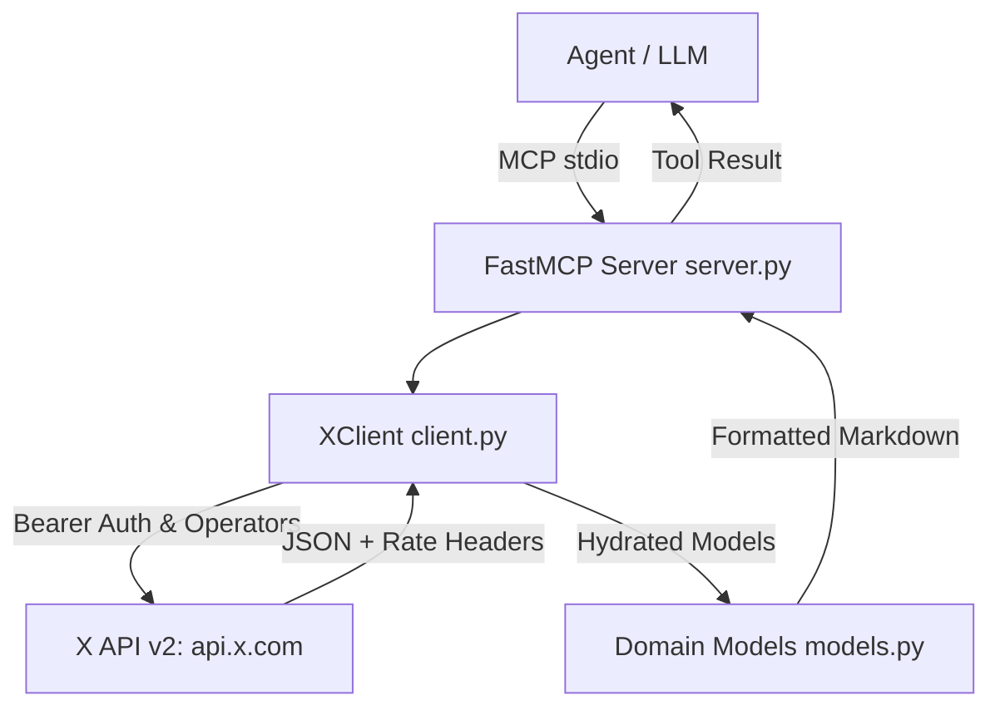

# X Search MCP Server & Antigravity Plugin Implementation Plan

> **For agentic workers:** REQUIRED SUB-SKILL: Use superpowers:subagent-driven-development (recommended) or superpowers:executing-plans to implement this plan task-by-task. Steps use checkbox (`- [ ]`) syntax for tracking.

**Goal:** Build a production-grade X (Twitter) Search MCP server and Antigravity plugin in Python 3.12+ using `uv`, `FastMCP`, and `httpx`, giving AI agents tools to query recent posts, look up individual posts, inspect engagement metrics, and handle pagination and rate limits.

**Architecture:** A modular Python package (`x_search`) strictly isolating X API HTTP communication and rate-limit tracking (`client.py`), domain entities (`models.py`), and FastMCP tool endpoints (`server.py`). The repository doubles as a self-contained Antigravity plugin with `plugin.json`, `mcp_config.json`, and an agent-facing skill (`skills/x-search/SKILL.md`).

**Tech Stack:** Python 3.12+, `uv`, `mcp` (FastMCP), `httpx`, `pydantic v2`, `python-dotenv`, `pytest`, `pytest-asyncio`, `ruff`.

---

## Global Constraints
- Strict Separation of Concerns (SoC): Network transport and X API v2 mechanics (`client.py`) must remain separate from domain representations (`models.py`) and protocol/presentation tool definitions (`server.py`).
- Runtime management exclusively via `uv` without requiring system-wide global package installs.
- Bearer token authentication supporting `X_BEARER_TOKEN` with automatic fallback to `TWITTER_BEARER_TOKEN`, loadable from environment or local `.env`.
- Clean agent-facing tool outputs formatted in readable Markdown with clear links, handles, dates, and engagement metrics.

## Review Focus
1. **API Rate Limit Exhaustion (HTTP 429)**: The client must extract `x-rate-limit-remaining` and `x-rate-limit-reset` headers and return human-readable retry recommendations instead of unhandled exceptions.
2. **Missing or Malformed Credentials**: When no Bearer token is found, tools must return a clean, actionable setup guide instructing how to set `X_BEARER_TOKEN`.
3. **URL vs Raw ID Post Lookup**: `get_post` must gracefully parse both numeric IDs (`123456789`) and full URLs (`https://x.com/username/status/123456789`).
4. **Author Hydration**: X API v2 returns authors in `includes.users`; the client must correctly join author profiles onto each post.
5. **Query Sanitization & Validation**: Queries exceeding X API length constraints or containing invalid operators must yield actionable errors.

---

## Proposed Changes



---

### Component 1: Project Scaffolding & Packaging

#### [NEW] `pyproject.toml`
Defines package metadata, entry points (`x-search = "x_search.cli:main"`), Python version floor (`>=3.12`), and dependencies:
- `mcp>=1.0.0`
- `httpx>=0.27.0`
- `pydantic>=2.0.0`
- `python-dotenv>=1.0.0`
- Dev dependencies: `pytest>=8.0.0`, `pytest-asyncio>=0.23.0`, `ruff>=0.4.0`

#### [NEW] `.gitignore`
Ignores `.venv/`, `__pycache__/`, `.pytest_cache/`, `.ruff_cache/`, `.env`, and dist build artifacts.

#### [NEW] `.env.example`
Provides documentation for configuring `X_BEARER_TOKEN` or `TWITTER_BEARER_TOKEN`.

---

### Component 2: Domain Models (`src/x_search/models.py`)

#### [NEW] `src/x_search/models.py`
Type-safe Pydantic models:
- `Author`: `id: str`, `username: str`, `name: str`, `verified: bool = False`, `profile_image_url: Optional[str] = None`
- `PublicMetrics`: `retweet_count: int = 0`, `reply_count: int = 0`, `like_count: int = 0`, `quote_count: int = 0`, `impression_count: Optional[int] = None`
- `Post`: `id: str`, `text: str`, `created_at: Optional[datetime] = None`, `author: Optional[Author] = None`, `metrics: Optional[PublicMetrics] = None`, `url: str`, `edit_history_tweet_ids: list[str] = []`
- `SearchResponse`: `posts: list[Post]`, `result_count: int`, `newest_id: Optional[str] = None`, `oldest_id: Optional[str] = None`, `next_token: Optional[str] = None`
- `RateLimitStatus`: `limit: Optional[int] = None`, `remaining: Optional[int] = None`, `reset_at: Optional[datetime] = None`, `reset_seconds: Optional[int] = None`

---

### Component 3: X API v2 Client (`src/x_search/client.py`)

#### [NEW] `src/x_search/client.py`
Asynchronous HTTP client:
- Signature: `class XClient: def __init__(self, bearer_token: Optional[str] = None, client: Optional[httpx.AsyncClient] = None)`
- Credentials loading: Checks explicit token, then `os.environ["X_BEARER_TOKEN"]`, then `os.environ["TWITTER_BEARER_TOKEN"]`.
- `async def search_recent(self, query: str, max_results: int = 10, next_token: Optional[str] = None, sort_order: str = "recency") -> SearchResponse`
  - Target: `GET https://api.x.com/2/tweets/search/recent`
  - Parameters: `query`, `max_results` (clamped 10..100), `tweet.fields=created_at,public_metrics,author_id`, `expansions=author_id`, `user.fields=username,name,verified`, optional `next_token`, `sort_order`.
  - Hydrates `author` mapping from `includes.users`.
  - Tracks rate limit headers into internal `last_rate_limit`.
- `async def get_post(self, post_id_or_url: str) -> Optional[Post]`
  - Parses status ID from numeric string or URL (`https://x.com/{user}/status/{id}`).
  - Target: `GET https://api.x.com/2/tweets/{id}`.
- `def get_rate_limit_status(self) -> RateLimitStatus`
  - Returns current rate limit state parsed from recent response headers.

---

### Component 4: FastMCP Server & CLI (`src/x_search/server.py`, `src/x_search/cli.py`)

#### [NEW] `src/x_search/server.py`
Defines FastMCP server instance and tool endpoints:
1. `search_recent_posts(query: str, max_results: int = 10, next_token: Optional[str] = None) -> str`
   - Invokes `client.search_recent()`, formats results into clean, legible Markdown with author `@handle`, post URL, text, timestamp, and like/repost counts. Includes `next_token` when available.
2. `get_post(post_id_or_url: str) -> str`
   - Looks up post by ID or URL, returns complete post details.
3. `check_rate_limits() -> str`
   - Returns remaining quota and countdown to reset.

#### [NEW] `src/x_search/cli.py`
CLI entrypoint running the server via standard I/O for MCP clients.

---

### Component 5: Antigravity Plugin & Agent Skill

#### [NEW] `plugin.json`
Antigravity plugin descriptor:
```json
{
  "name": "x-search",
  "displayName": "X (Twitter) Search Tool",
  "description": "Search recent posts on X (Twitter), inspect engagement metrics, and lookup posts by ID or URL.",
  "suggestedPrompts": [
    "Search X for recent discussions about Python 3.13",
    "Find recent high-engagement posts mentioning @OpenAI",
    "Lookup this post: https://x.com/user/status/123456789"
  ]
}
```

#### [NEW] `mcp_config.json`
Configures the MCP server using `uv run`:
```json
{
  "mcpServers": {
    "x-search": {
      "command": "uv",
      "args": ["run", "--directory", "/Users/andrew/Documents/GitHub/x-search-tool", "x-search"]
    }
  }
}
```

#### [NEW] `skills/x-search/SKILL.md`
Agent guidance document explaining:
- How to query X API v2 using operators (`from:`, `to:`, `@mention`, `#hashtag`, `url:`, `lang:en`, `-is:retweet`, `-is:reply`, `has:images`, `has:media`, `min_faves:`).
- Query syntax rules (exact phrases in quotes, negation with `-`).
- Pagination flow using `next_token`.
- How to handle rate limit pauses and missing token configuration.

#### [NEW] `README.md`
Documentation for setup, testing, environment variables, and standalone MCP client configuration.

---

## Tasks & Execution Plan

### Task 1: Project Setup & Package Scaffolding
**Files:**
- Create: `pyproject.toml`, `.gitignore`, `.env.example`, `src/x_search/__init__.py`
- Test: Environment creation with `uv venv` and `uv sync`

- [ ] **Step 1: Write `pyproject.toml`, `.gitignore`, and `.env.example`**
- [ ] **Step 2: Initialize venv with `uv sync`**
- [ ] **Step 3: Verify package is importable**
- [ ] **Step 4: Commit scaffolding**

---

### Task 2: Domain Models & Unit Tests
**Files:**
- Create: `src/x_search/models.py`
- Test: `tests/test_models.py`

**Interfaces:**
- Produces: `Author`, `PublicMetrics`, `Post`, `SearchResponse`, `RateLimitStatus`

- [ ] **Step 1: Write unit tests for models (`tests/test_models.py`)**
  - Test serialization, URL generation (`https://x.com/{username}/status/{id}`), and fallback when username is unknown.
- [ ] **Step 2: Run tests to verify failure**
- [ ] **Step 3: Implement `src/x_search/models.py`**
- [ ] **Step 4: Run tests to verify pass**
- [ ] **Step 5: Commit models**

---

### Task 3: X API Client & Comprehensive Mocks
**Files:**
- Create: `src/x_search/client.py`
- Test: `tests/conftest.py`, `tests/test_client.py`

**Interfaces:**
- Consumes: Models from `src/x_search/models.py`
- Produces: `XClient.search_recent()`, `XClient.get_post()`, `XClient.get_rate_limit_status()`

- [ ] **Step 1: Write mock fixtures in `tests/conftest.py` with realistic X API v2 JSON payloads**
- [ ] **Step 2: Write unit tests in `tests/test_client.py`**:
  - Test query construction and parameter encoding.
  - Test author hydration from `includes.users`.
  - Test post ID extraction from raw IDs and URLs.
  - Test HTTP 429 rate limit parsing and header tracking.
  - Test missing bearer token error handling.
- [ ] **Step 3: Run tests to verify failure**
- [ ] **Step 4: Implement `src/x_search/client.py`**
- [ ] **Step 5: Run tests to verify pass**
- [ ] **Step 6: Commit client**

---

### Task 4: FastMCP Server & Tool Handlers
**Files:**
- Create: `src/x_search/server.py`, `src/x_search/cli.py`
- Test: `tests/test_server.py`

**Interfaces:**
- Consumes: `XClient`
- Produces: MCP tools `search_recent_posts`, `get_post`, `check_rate_limits`

- [ ] **Step 1: Write unit tests for MCP server tools in `tests/test_server.py`**
  - Verify Markdown output formatting for posts.
  - Verify error handling when API returns 429 or auth errors.
- [ ] **Step 2: Run tests to verify failure**
- [ ] **Step 3: Implement `src/x_search/server.py` and `src/x_search/cli.py`**
- [ ] **Step 4: Run tests to verify pass**
- [ ] **Step 5: Commit server**

---

### Task 5: Antigravity Plugin Integration & Skill Documentation
**Files:**
- Create: `plugin.json`, `mcp_config.json`, `skills/x-search/SKILL.md`, `README.md`
- Test: Plugin format validation and CLI execution test (`uv run x-search --help` or stdio ping)

- [ ] **Step 1: Write `plugin.json` following Antigravity plugin schema**
- [ ] **Step 2: Write `mcp_config.json` with `uv run` command**
- [ ] **Step 3: Write comprehensive `skills/x-search/SKILL.md` covering X search operators**
- [ ] **Step 4: Write `README.md`**
- [ ] **Step 5: Run full test suite with `uv run pytest` and lint check with `uv run ruff check`**
- [ ] **Step 6: Commit plugin & skill assets**

---

## Verification Plan

### Automated Tests
1. Run complete pytest suite:
   ```bash
   uv run pytest -v
   ```
2. Run ruff linter and formatter verification:
   ```bash
   uv run ruff check .
   uv run ruff format --check .
   ```

### Manual Verification
1. Test CLI entrypoint invocation:
   ```bash
   uv run x-search
   ```
2. Verify MCP server announces tools (`search_recent_posts`, `get_post`, `check_rate_limits`).
3. (If user provides an active `X_BEARER_TOKEN`): Run a live query test.
